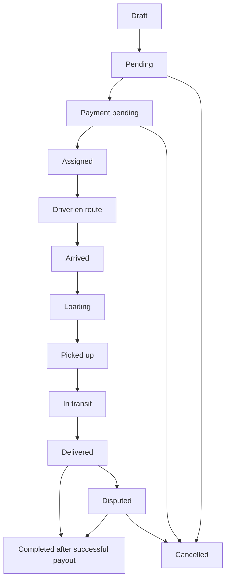
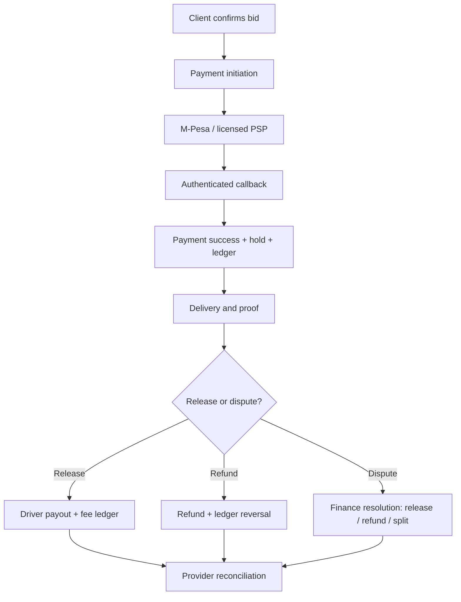

# TaniAfrika Project Architecture, Technology Stack and Delivery Blueprint

**Document status:** Team baseline — staging foundation validated  
**Version:** 1.0  
**As of:** 24 August 2026  
**Audience:** Founders, product, design, engineering, operations, support, finance, compliance and implementation partners  
**Current milestone:** Backend foundation validated in hosted staging; pre-integration

> This document separates what is implemented and verified from what is planned. It is the working technical baseline for completing TaniAfrika as a secure, reliable, mobile-first Kenyan moving and delivery marketplace.

<!-- DOCX_START -->

## Document control

| Field | Value |
|---|---|
| Product | TaniAfrika |
| Working product category | Two-sided marketplace for house moves, business deliveries and parcels |
| Working brand direction | “Reliable Neighbour”: green-led, Kenyan, dependable, clear and accessible |
| Source of truth reviewed | Current Next.js/Supabase source, seven SQL migrations, nine Edge Functions, generated database types, route/build output and the product/brand brief |
| Staging project | `TaniAfrika-Staging` — project reference `xnhnqbgpezfcvjptufao` |
| Staging region | West EU (Ireland) |
| Validation result | 53 public tables, critical RPC contract, nine Edge Function sources, database lint, type generation and production web build passed |
| What is not yet live | Edge Functions, external secrets, M-Pesa/payment processing, scheduled workers, role-based end-to-end tests and production |
| Decision authority | Product scope: product lead; architecture/security: engineering lead; money movement: finance plus legal/compliance; visual system: design lead |

### How to read this document

- **Implemented and verified** means the capability exists in source or staging and was covered by the completed validation.
- **Implemented, not activated** means the database or function source exists, but secrets, deployment, scheduling or external provider access is still missing.
- **Partial** means there is a usable starting implementation but not the complete production workflow.
- **Planned** means the capability is required for the target product but is not complete.
- “Escrow” refers to the product’s hold-and-release workflow. It must be implemented through an appropriately licensed payment-service or banking arrangement; the platform must not represent that it independently holds regulated customer funds unless counsel and the provider agreement confirm this.

## 1. Executive summary

TaniAfrika is being designed as a Kenyan, mobile-first marketplace that connects clients who need goods or household items moved with verified drivers and suitable vehicles. The initial service catalogue covers house moves, business deliveries and parcels. The product must support the complete lifecycle from identity and driver verification through quote/bid selection, payment authorization, dispatch, live delivery progress, proof of delivery, driver payout, refunds, disputes, support and safety response.

The correct architecture for the current stage is a **modular monolith**, not an early microservice estate. One Supabase PostgreSQL database is the system of record. Business domains are separated through explicit tables, enums, row-level security, transactional database functions and Edge Function adapters. A durable outbox separates committed business events from notification delivery. This gives the team strong transaction safety and a straightforward operating model now, while preserving clear seams for extracting high-volume services later.

The current achievement is significant but specific: the full backend database foundation has been deployed to the empty hosted staging project and validated. Seven migrations match local and remote history. Public/private database lint passed. Database types were regenerated. The Next.js production build passed. The source contains 53 public tables, 14 public business functions, comprehensive row-level security and nine Edge Functions.

The product is **not yet production-ready**. The next milestone is runtime enablement: configure staging secrets, deploy the nine Edge Functions, schedule four workers, create controlled role-based test users and run end-to-end payment, payout, refund, dispatch and permission tests. After this, the team must finish the client, driver and staff experiences; complete M-Pesa sandbox certification and the regulated safeguarded-funds arrangement; add production routing, background location, notifications, operational tooling and observability; and pass security, privacy, recovery and pilot-readiness gates.

### Architectural principles

1. **PostgreSQL is the source of truth.** State transitions, money movements and access boundaries are enforced close to the data.
2. **Money is integer-based and auditable.** Amounts use minor units, currencies are explicit and posted ledger transactions are immutable and balanced.
3. **Every external callback is untrusted.** Authenticate, validate, deduplicate, record and reconcile provider events.
4. **No client receives privileged credentials.** Browser code uses only a Supabase publishable/anon key; server secrets remain in Edge Function or trusted server environments.
5. **Least privilege by default.** RLS, column grants, private storage, staff role checks and controlled service-role use protect data.
6. **Business actions are idempotent.** Replays must not duplicate charges, ledger entries, payouts, refunds or notifications.
7. **Async delivery is durable.** Commit business state first; deliver side effects through the outbox with retry and dead-letter handling.
8. **Kenyan mobile realities shape the product.** Optimize for mid-tier Android devices, variable networks, M-Pesa familiarity, clear language and low-friction recovery.
9. **Design is token-driven.** The working green direction can change without changing backend contracts.
10. **Scale follows evidence.** Measure load and service ownership before extracting services.

## 2. Current milestone and readiness snapshot

### 2.1 Milestone statement

**Current milestone: Backend foundation validated in hosted staging; pre-integration.**

This means the schema and application compile together and the staging database is structurally ready. It does not mean the payment provider, Edge Functions, scheduled jobs, notifications or role workflows are operating end to end.

| Area | Status | Evidence / meaning | Immediate action |
|---|---|---|---|
| Product and brand brief | Partial | Target users and “Reliable Neighbour” direction defined; final design system is still in progress | Freeze shared design-token names, not final colours |
| Web application | Partial | Next.js production build passes; core client, driver and admin routes exist | Connect all flows to generated database types and complete missing portals |
| Database schema | Implemented and verified | Seven migrations applied; 53 public tables; local/remote history matches | Protect migration workflow and add integration/RLS tests |
| Row-level security | Implemented, test depth pending | RLS enabled for exposed tables and Storage; policies and column grants exist | Test every role/action matrix, including negative cases |
| Transactional RPCs | Implemented, integration pending | Bid acceptance, order transitions, payment, payout, refund and dispute procedures exist | Exercise RPCs with real staged identities and callback replays |
| Edge Functions | Implemented, not deployed | Nine function source directories are present | Configure secrets, deploy and smoke-test |
| Payment and hold/release | Structurally implemented, disabled | Payment/escrow/ledger schema and adapters exist; feature flags disabled | Confirm licensed provider model and complete M-Pesa sandbox work |
| Dispatch and tracking | Partial | Bidding, offers, availability and foreground browser location structures exist | Add production routing, ranking rules and background/offline tracking |
| Support and safety | Backend foundation only | Case, incident, evidence and emergency-contact tables exist | Build staff/user workflows and escalation playbooks |
| Notifications | Backend foundation only | Notifications, preferences, device tokens and outbox exist | Select providers, deploy dispatcher and test consent/preferences |
| Operations/finance tooling | Planned/partial | Admin basics exist; dedicated support, operations and finance workspaces do not | Build queue- and exception-driven staff portals |
| Automated quality gates | Partial | lint/build/static audit/DB lint pass | Add CI, unit, integration, E2E, load, security and restore tests |
| Production operations | Not started | No production project, monitoring, on-call or production provider setup | Define release gates, production region and runbooks |

### 2.2 Verified deployment record

The following migration versions are applied and matched in local and remote staging history:

| Migration | Purpose |
|---|---|
| `20260823090000_core_identity.sql` | Identity, profiles, organisations, roles, service areas, service types and initial platform configuration |
| `20260823091000_marketplace_dispatch.sql` | Orders, stops, items, bids, dispatch, vehicles, availability, locations and marketplace workflows |
| `20260823092000_payments_escrow_ledger.sql` | Payment intents, provider events, transactions, escrow holds, double-entry ledger, payouts and reconciliation |
| `20260823093000_safety_support_operations.sql` | Support, incidents, evidence, notifications, outbox, audit, consent, privacy requests and reviews |
| `20260823094000_rls_and_storage.sql` | Row-level security, grants, limited public views and controlled Storage buckets |
| `20260823095000_hardening_fixes.sql` | Security and correctness hardening discovered during audit |
| `20260823096000_refunds_and_dispute_resolution.sql` | Refund lifecycle and controlled financial dispute resolution |

Completed validation:

- Backend contract audit passed: 53 public tables, 10 critical RPC checks and nine Edge Function directories.
- Public and private database schemas passed linting.
- Supabase database types were generated into `src/types/database.generated.ts`.
- The Next.js 16.2.10 production build compiled, type-checked and generated all routes successfully.
- No remote database reset was used.

Open engineering hygiene items:

- Eight ESLint warnings remain; they are non-blocking but should be removed before the production quality gate.
- The Next.js `middleware` file convention is deprecated; migrate to the `proxy` convention supported by the deployed Next.js version.
- The dependency audit reported three high-severity findings. Review and upgrade deliberately with regression tests; do not apply an uncontrolled forced upgrade.
- Commit and protect the exact package lockfile used by CI and deployment.
- Consolidate legacy hand-written Supabase types with the generated database types.

## 3. Product definition and brand direction

### 3.1 Product promise

TaniAfrika should let a client arrange a trusted move or delivery with the same clarity they expect from a leading mobility marketplace: transparent request details, eligible drivers, informed price selection, predictable pickup and delivery progress, protected payment, accountable proof and fast support when an exception occurs.

### 3.2 Primary users

| Actor | Core need | Product response |
|---|---|---|
| Individual client | Move household goods or send a parcel without uncertainty | Simple request, clear vehicle choice, bids/price, verified driver, tracking, payment protection and proof |
| SME/business client | Repeat or multi-stop delivery with accountability | Organisation membership, saved places, order history, reporting and controlled staff access |
| Driver | Find suitable paid work and receive predictable earnings | Verification, vehicle profile, availability, nearby orders, bidding, navigation, status flow, earnings and payout visibility |
| Support agent | Resolve customer/driver issues efficiently | Case timeline, messages, linked order/payment, evidence, SLA and controlled resolution tools |
| Operations agent | Keep the marketplace moving safely | Driver approvals, dispatch exceptions, live order oversight, service areas and incident handling |
| Finance agent | Control money movement and reconciliation | Payment/payout/refund queues, ledger, provider events, reconciliation and audited adjustments |
| Administrator | Configure and govern the platform | Roles, flags, settings, pricing, service areas and audit access |

### 3.3 Working brand system

The team’s current direction is green-led and should feel familiar, reliable and Kenyan. It can use the trust cues associated with common Kenyan mobile services without copying another company’s protected visual identity.

| Token | Working value | Purpose |
|---|---:|---|
| Trust Green | `#1F5F3F` | Primary brand, navigation, key confirmations |
| Success Green | `#2D8659` | Successful states and progress |
| Amber | `#D4A244` | Warm accent and selected emphasis |
| Cream | `#F7F1E5` | Calm page background |
| Deep Charcoal | `#2A2A28` | Main text |
| Muted Sage | `#7A9080` | Secondary content and borders |
| Alert Amber | `#D97706` | Warnings and attention states |
| Error Rust | `#B33A2A` | Destructive/error states |

Design requirements:

- Mobile-first, with readable type on mid-tier Android devices; body text should not fall below 14 px.
- WCAG 2.2 AA contrast and keyboard/touch accessibility.
- English first with carefully placed Kiswahili/Sheng; full Kiswahili remains a feature-gated later release.
- Real Kenyan photography and practical illustrations; avoid generic luxury imagery.
- Use semantic tokens such as `brand-primary`, `surface`, `success`, `warning` and `danger`, so the designer can refine colours without changing components or backend logic.
- Replace remaining legacy orange UI styling with the approved token system once the final visual specification is delivered.

## 4. Scope and responsibility boundaries

### 4.1 Core product journeys

**Client journey**

1. Register or sign in and complete a basic profile.
2. Choose service type, pickup/drop-off or multiple stops, schedule, vehicle class, items and evidence photos.
3. Receive an estimate and/or driver bids.
4. Select a bid and authorize payment.
5. Follow driver assignment, arrival, loading, transit and delivery in real time.
6. Review delivery proof, confirm completion or raise a dispute.
7. Receive payment/refund updates and rate the service.

**Driver journey**

1. Register, choose driver role and complete identity/vehicle onboarding.
2. Submit required documents and wait for approval.
3. Go online, share location according to consent and see eligible nearby work.
4. Bid or accept a dispatch offer, then navigate to pickup.
5. Update controlled delivery states and collect proof.
6. See earnings, fees, payout status and statements.
7. Contact support or trigger a safety workflow when required.

**Staff journey**

1. Review driver and vehicle verification queues.
2. Monitor order, dispatch, safety and payment exceptions.
3. Resolve support cases and financial disputes using role-limited actions.
4. Reconcile provider activity against internal transactions and ledger entries.
5. Configure service areas, pricing, flags and operational settings.
6. Review audit history and operational metrics.

### 4.2 In scope for a fully functional first production release

- Individual and SME accounts; client and driver onboarding.
- Driver/vehicle/document verification and suspension/reverification.
- House move, business delivery and parcel requests.
- Scheduled, multi-stop, vehicle-class and item-aware orders.
- Manual marketplace bidding plus operations-assisted dispatch.
- Route, ETA and service-area validation through a production-grade map provider.
- M-Pesa customer payment, controlled hold/release, driver disbursement, refunds, disputes and reconciliation.
- Live delivery states, location updates, proof of pickup/delivery and order history.
- In-app messaging, push/SMS/email where justified, and notification preferences.
- Support cases, safety incidents, emergency contacts and evidence handling.
- Driver earnings and payout statements.
- Role-specific operations, support, finance and admin workspaces.
- Audit, consent, privacy-request handling and retention jobs.
- Observability, backup/restore, security testing, CI/CD and controlled release.

### 4.3 Deliberately deferred until after evidence from the pilot

- Automated dynamic/surge pricing.
- Fully automatic driver assignment replacing bidding.
- Driver wallet or stored-value product.
- Credit accounts, lending or BNPL.
- Cross-border operations and multi-country tax handling.
- Complex route optimization across large fleets.
- Separate microservices per domain.

These are not excluded forever. They require demand, operational maturity, licensing or scale evidence before implementation.

## 5. System architecture

### 5.1 System context

```mermaid
flowchart TD
    Users["Clients · Drivers · Staff"] --> Web["Next.js Web / PWA"]
    Web --> Supabase["Supabase Platform"]
    Supabase --> Data["PostgreSQL · Auth · Realtime · Storage"]
    Supabase --> Edge["Deno Edge Functions"]
    Edge --> Money["M-Pesa / Licensed PSP"]
    Edge --> Notify["Push · SMS · Email Provider"]
    Edge --> Data
    Data --> Observe["Logs · Metrics · Alerts · Audit"]
```

<!-- DOCX_DIAGRAM:system_context -->

The web application is the current client surface. It uses Supabase Auth for identity, the Data API and transactional RPCs for authorized data access, Realtime for live updates and Storage for controlled documents/evidence. Edge Functions form the trusted integration boundary for payment APIs, callbacks, payouts, refunds, reconciliation and notification delivery.

### 5.2 Chosen architecture: modular monolith

```mermaid
flowchart TD
    Entry["Web · Staff tools · Edge Functions"] --> Boundary["RLS · RPCs · Validation"]
    Boundary --> Identity["Identity · Organisations · Fleet"]
    Boundary --> Market["Orders · Bids · Dispatch · Location"]
    Boundary --> Money["Payments · Holds · Ledger · Payouts"]
    Boundary --> Trust["Support · Safety · Privacy · Audit"]
    Identity --> DB[("PostgreSQL system of record")]
    Market --> DB
    Money --> DB
    Trust --> DB
    DB --> Outbox["Durable event outbox"]
```

<!-- DOCX_DIAGRAM:domain_architecture -->

Why this is appropriate now:

- Bid acceptance, order state and money state often need one atomic transaction.
- A small team can operate one authoritative database more reliably than many distributed services.
- Domain boundaries are explicit in schema and function names, so later extraction remains possible.
- Supabase provides managed Auth, Postgres, Realtime, Storage and Edge Functions without introducing several operational platforms.
- The outbox prevents external notification/provider failures from corrupting committed marketplace state.

The architecture should be split only when measurement shows a boundary needs independent scaling, ownership, deployment cadence or availability. Likely future candidates are dispatch/location ingestion, notification delivery and payment orchestration.

### 5.3 Layer responsibilities

| Layer | Responsibilities | Must not do |
|---|---|---|
| Presentation | Responsive role-specific UI, form validation, optimistic feedback, accessible status and recovery | Embed secrets or enforce business-critical authorization only in the browser |
| Web/server layer | Session handling, protected routing, server-rendered reads, request shaping | Bypass RLS with broad privileged access for ordinary user work |
| Database/API | Authoritative state, RLS, constraints, atomic RPCs, audit links | Call external providers inside long database transactions |
| Edge integration | Provider authentication, callbacks, retry-safe orchestration, scheduler entry points | Treat provider callbacks as trusted or write unbalanced money records |
| Async delivery | Outbox claiming, retries, dead-lettering and notification fan-out | Lose events silently after a transient failure |
| Operations | Monitoring, alerts, support/finance queues, incident response and reconciliation | Depend on direct manual database editing for normal operations |

## 6. Technology stack

| Concern | Current technology | Use in TaniAfrika | Production decision / note |
|---|---|---|---|
| Web framework | Next.js 16.2.10, App Router | Role-based pages, server rendering, server actions/routing | Replace deprecated middleware convention with `proxy`; define hosting platform |
| UI runtime | React 19.2.4 | Client/server components and interactive workflows | Keep role views responsive and accessible |
| Language | TypeScript 5, strict mode | Shared contracts and compile-time safety | Generate DB types in CI and remove duplicate manual types |
| Styling | Tailwind CSS 4 | Component styling and responsive layouts | Introduce final semantic design tokens from designer |
| Backend platform | Supabase | Managed Postgres, Auth, Data API, Realtime, Storage, Edge Functions | Separate staging and production projects with independent secrets |
| Database | PostgreSQL 15 target | System of record and transactional business rules | Add workload monitoring, restore tests and production capacity plan |
| Extensions | `pgcrypto`, `citext`, PostGIS | IDs/crypto helpers, case-insensitive text and geospatial data | Confirm indexes and query plans with realistic location volume |
| Authentication | Supabase Auth + SSR helper | Sessions, signup, reset and role-bound access | Add phone OTP if required, staff MFA, device/session controls and abuse protection |
| API model | Supabase Data API + PostgreSQL RPCs | CRUD reads plus safe multi-record transactions | Prefer RPCs for critical state/money operations |
| Realtime | Supabase Realtime | Order, bid, message and location updates | Load-test channel strategy and minimize location fan-out |
| File storage | Supabase Storage | Avatars, driver/vehicle documents and order evidence | Add malware/content checks, retention and signed-access UX |
| Trusted compute | Supabase Edge Functions, Deno | Payment adapters, callbacks, workers and notifications | Deploy nine functions with scoped secrets and structured logs |
| Mapping UI | Leaflet 1.9.4 + React Leaflet 5.0.0 | Map display and order/location visualization | Current public OSM tiles are not a production routing stack; select managed/self-hosted tiles, geocoding and routing |
| Charts | Recharts 3.9.2 | Admin/operations metrics | Drive charts from governed metrics and aggregated views |
| Linting | ESLint 9 + Next.js configuration | Static code quality | Resolve remaining warnings and run in CI |
| Toolchain | Node.js 24.13.0 used in validation | Install, lint, build and scripts | Pin supported Node version in project metadata/CI |
| Backend CLI | Supabase CLI 2.115.0 | Link, dry-run, migrate, lint, deploy and type generation | Keep pinned; promote reviewed migrations through environments |
| Testing foundation | Static backend audit and SQL schema-contract tests | Validates expected objects and build contract | Add unit, RLS, integration, E2E, load and failure-injection suites |

## 7. Application and route architecture

### 7.1 Current web route map

| Area | Routes present | Current capability |
|---|---|---|
| Public/auth | `/`, `/login`, `/signup`, `/callback`, `/reset-password` | Landing/authentication, role selection, password recovery and callback handling |
| Client | `/client`, `/client/orders`, `/client/orders/new`, `/client/orders/[id]`, `/client/messages`, `/client/profile` | Dashboard, create/list/detail, bids, driver details, maps, messaging and profile |
| Driver | `/driver`, `/driver/active`, `/driver/bids`, `/driver/orders`, `/driver/orders/[id]`, `/driver/messages`, `/driver/earnings`, `/driver/profile` | Availability, order discovery, bid management, active job, foreground tracking, earnings and profile |
| Existing admin | `/orders`, `/orders/[id]`, `/bids`, `/clients`, `/drivers` | Marketplace overview, order/bid management and driver approval basics |

### 7.2 Required portal completion

The database supports six roles: `client`, `driver`, `support`, `operations`, `finance` and `admin`. The current route guard and navigation primarily understand client, driver and admin. Before production:

- Add dedicated support, operations and finance route groups and dashboards.
- Define a central permission matrix independent of navigation labels.
- Enforce staff MFA and stronger session policy.
- Ensure server actions use RLS or narrowly scoped privileged helpers.
- Remove production console logs containing user/profile context.
- Add organisation membership switching for SME users.
- Add complete payment, dispute, refund, support, safety, KYC and notification interfaces.

### 7.3 Frontend architectural conventions

- Use server components for initial authorized reads and client components only where interaction/realtime requires them.
- Keep Supabase browser and server clients separate; never import a secret/server client into browser bundles.
- Generate application types from the database and use view models for UI-specific shapes.
- Centralize order/payment status labels and state permissions; do not duplicate partial maps across pages.
- Treat maps, messaging and location tracking as isolated feature modules with explicit cleanup and error states.
- Use accessible semantic components and visible recovery paths for weak networks.
- Add a PWA manifest, install experience and carefully scoped offline behaviour. Never show a state-changing action as completed until the server confirms it.

## 8. Data architecture

### 8.1 Domain inventory: 53 public tables

#### Identity, organisations and consent

| Table | Purpose |
|---|---|
| `profiles` | Private user profile and account state linked to Auth |
| `user_roles` | Many-to-many platform role assignments |
| `organisations` | SME/business tenant record |
| `organisation_members` | Organisation membership and member role |
| `consent_records` | Evidence of user consent and policy version |
| `data_subject_requests` | Privacy access, correction, deletion and related requests |
| `saved_places` | User or organisation pickup/drop-off addresses |

#### Driver and fleet

| Table | Purpose |
|---|---|
| `driver_profiles` | Driver-specific onboarding, approval and operating state |
| `driver_documents` | Identity/licence/conduct and related KYC documents |
| `vehicles` | Vehicle identity, classification, ownership and status |
| `vehicle_documents` | Insurance, logbook, inspection and related evidence |
| `driver_vehicle_assignments` | Time-aware association of drivers and vehicles |
| `vehicle_classes` | Capacity and service eligibility catalogue |

#### Marketplace, dispatch and location

| Table | Purpose |
|---|---|
| `service_types` | House move, business delivery and parcel catalogue |
| `service_areas` | Geographical operating boundaries and activation state |
| `pricing_rules` | Versioned/configurable pricing inputs |
| `orders` | Main order aggregate, participants, schedule, price and lifecycle |
| `order_stops` | Ordered pickup, drop-off and intermediate stops |
| `order_items` | Items, quantity, dimensions/weight and handling notes |
| `order_attachments` | Photos/documents linked to an order |
| `order_status_history` | Immutable order-state timeline |
| `bids` | Driver offers, amount, ETA and lifecycle |
| `bid_messages` | Conversation attached to a bid/order context |
| `dispatch_offers` | Directed offers to eligible drivers |
| `driver_availability_sessions` | Online/offline working sessions |
| `driver_locations` | Current driver location snapshot |
| `driver_location_events` | Historical/operational location event stream |

#### Payments, hold/release and accounting

| Table | Purpose |
|---|---|
| `payment_intents` | Client payment request and provider correlation |
| `payment_provider_events` | Raw/normalized provider callback record and deduplication |
| `payment_transactions` | Payment, payout and refund transaction attempts/results |
| `escrow_holds` | Internal hold/release/refund state linked to an order |
| `ledger_accounts` | Client clearing, platform fee, driver payable and other accounts |
| `ledger_transactions` | Accounting transaction header and posting state |
| `ledger_entries` | Debit/credit lines; balanced before posting |
| `payout_accounts` | Tokenized/controlled driver destination details |
| `payouts` | Driver disbursement lifecycle |
| `refunds` | Client refund lifecycle |
| `financial_disputes` | Payment/hold dispute, evidence and resolution state |
| `reconciliation_runs` | Provider-to-ledger reconciliation batch |
| `reconciliation_items` | Matched, missing or mismatched records in a run |

#### Support, safety, quality and communications

| Table | Purpose |
|---|---|
| `support_cases` | Support case, ownership, priority, SLA and linked entity |
| `support_case_messages` | Customer/driver/staff case conversation |
| `emergency_contacts` | User-designated safety contacts |
| `safety_incidents` | Operational safety incident and response state |
| `safety_incident_evidence` | Restricted evidence linked to an incident |
| `reviews` | Post-service ratings/reviews and moderation state |
| `notifications` | User-visible notification and delivery state |
| `notification_preferences` | Channel/category opt-in and delivery choices |
| `device_tokens` | Push-notification device registration |
| `event_outbox` | Durable committed events awaiting delivery |

#### Governance and platform operations

| Table | Purpose |
|---|---|
| `feature_flags` | Controlled feature activation by environment/audience |
| `system_settings` | Versioned operational configuration |
| `audit_events` | Security and business audit trail |

### 8.2 Enumerated state models

The schema defines 30 enums so states are controlled rather than free-text. Major groups include:

- Account/identity: `account_status`, `app_role`, `approval_status`, `verification_status`, `organisation_member_role`, `document_type`.
- Marketplace: `order_status`, `bid_status`, `dispatch_offer_status`, `vehicle_type`.
- Money: `payment_provider`, `payment_intent_status`, `payment_transaction_type`, `payment_transaction_status`, `escrow_status`, `payout_status`, `refund_status`, `financial_dispute_status`, `ledger_account_type`, `ledger_entry_side`, `reconciliation_status`.
- Operations: `case_status`, `case_priority`, `incident_status`, `review_status`, `notification_channel`, `notification_status`, `outbox_status`, `data_request_type`, `data_request_status`.

### 8.3 Order lifecycle

<!-- DOCX_DIAGRAM:order_lifecycle -->

The database is the authority for allowed transitions. Drivers progress operational states for assigned work. Clients may cancel only in eligible early states and may dispute delivered work. Staff overrides require role checks and auditability. Completion is tied to successful payout, so the product does not claim a financially complete order while driver money is unresolved.

### 8.4 Data quality rules

- Use UUID primary keys and explicit foreign keys.
- Store money as integer minor units and always store/validate ISO currency.
- Store all system times in UTC; convert to Africa/Nairobi in the UI where appropriate.
- Use constraints and enums for valid state, quantity and amount ranges.
- Keep immutable history/audit entries for consequential transitions.
- Use idempotency and unique provider references for callback replay safety.
- Apply geospatial indexes to service areas and high-volume location queries.
- Partition `driver_location_events`, provider events and audit history when volume justifies it.
- Retain only data required for service, safety, accounting and legal duties.

## 9. Transaction and RPC boundaries

Critical multi-record operations are implemented as database functions so validation, state mutation, ledger records and audit/outbox effects commit together.

| Public function | Responsibility | Key control |
|---|---|---|
| `accept_bid` | Accept one eligible bid, reject/close alternatives and assign the order | Client ownership, order/bid state and one-winner atomicity |
| `update_order_status` | Move an order through allowed lifecycle transitions | Actor role, assignment and transition matrix |
| `record_payment_success` | Apply a verified successful provider payment | Callback-only trusted path, idempotency and hold/ledger creation |
| `request_escrow_release` | Approve eligible held funds for settlement | Delivered/dispute checks and one-time transition |
| `record_payout_success` | Apply successful driver disbursement | Provider reference, idempotency, ledger and order completion |
| `queue_order_refund` | Validate and queue a refund against eligible funds | Amount ceiling, order/payment state and dispute rules |
| `record_refund_success` | Apply completed refund | Provider evidence, idempotency and balanced ledger |
| `open_financial_dispute` | Freeze or mark held money and open a controlled dispute | Eligible participant and state checks |
| `resolve_financial_dispute` | Decide release/refund/split according to controlled resolution | Finance/admin role and auditable reason |
| `submit_review` | Create a post-service review | Completed eligible order and one-review rules |
| `claim_outbox_events` | Lease ready async events to a worker | Skip-locked concurrency and retry safety |
| `complete_outbox_event` | Mark delivery success/failure and schedule retries | Lease ownership, attempt count and dead-letter rules |
| `expire_payment_reservations` | Expire abandoned payment intents/holds | Scheduled, deterministic and idempotent cleanup |
| `purge_expired_operational_data` | Remove data beyond configured retention | Scheduled policy, protected accounting/audit exceptions |

For every RPC, the test suite must include success, unauthorized actor, wrong state, duplicate request, concurrent request and rollback cases.

## 10. Security, authorization and storage

### 10.1 Authorization model

- Supabase Auth provides identity; application roles are stored separately in `user_roles`.
- Supported roles are client, driver, support, operations, finance and admin.
- Row-level security is enabled for all public application tables.
- Default broad anonymous/authenticated grants are revoked and replaced with controlled table/column access and policies.
- Marketplace discovery uses a limited `profiles_public` view rather than exposing private profile fields.
- Privileged functions must use fixed `search_path`, validate actor role and minimize `SECURITY DEFINER` scope.
- Server/Edge secrets never enter `.env.local` values exposed to the browser. The web app should use only the publishable/anon key.

The migrations contain 96 named policy definitions, with 101 policy-creation statements across the migration history because some policies are hardened/recreated. The meaningful release gate is not the count: it is a role/action test matrix showing that each actor can access only the intended rows and columns.

### 10.2 Storage buckets

| Bucket | Visibility | Limit | Allowed types | Intended use |
|---|---|---:|---|---|
| `avatars` | Public | 5 MiB | JPEG, PNG, WebP | Public profile avatar |
| `driver-documents` | Private | 10 MiB | JPEG, PNG, PDF | Driver verification documents |
| `vehicle-documents` | Private | 10 MiB | JPEG, PNG, PDF | Vehicle verification documents |
| `order-evidence` | Private | 15 MiB | JPEG, PNG, WebP, PDF | Item, pickup, delivery, dispute and incident evidence |

Required hardening before production:

- Confirm delete policies check record verification state as well as folder ownership. The current driver-document delete policy name implies “unverified”, but its storage-folder condition should be explicitly tested against the database record.
- Use short-lived signed URLs for private downloads and log staff access where legally appropriate.
- Scan files, verify actual MIME signatures, normalize filenames and reject executable content.
- Remove sensitive metadata from images where practical.
- Define retention and legal-hold rules for evidence and KYC documents.

### 10.3 Security backlog

- Staff MFA, session lifetime, device/session revocation and recovery controls.
- Rate limits for signup, login, OTP, bid creation, messaging, payment initiation and callbacks.
- Bot/credential-stuffing protection and abuse monitoring.
- Secret rotation, environment separation and log redaction.
- Dependency/SBOM scanning and controlled patch policy.
- SAST, secret scanning, infrastructure/configuration checks and penetration testing.
- Threat-model reviews for account takeover, fake drivers, payment replay, location privacy, evidence access and staff privilege abuse.
- WAF/API protection appropriate to the hosting platform.

## 11. Edge Functions and external integration architecture

### 11.1 Function catalogue

| Function | Caller/authentication | Purpose | Deployment status |
|---|---|---|---|
| `payment-initiate` | Authenticated user JWT | Validate order and start M-Pesa customer payment | Source complete; not deployed |
| `escrow-release` | Authenticated authorized user JWT | Request eligible hold release | Source complete; not deployed |
| `mpesa-callback` | Public provider callback + high-entropy callback token | Receive STK result, store provider event and record success/failure | Source complete; not deployed |
| `mpesa-b2c-callback` | Public provider result/timeout + callback token | Apply payout outcome | Source complete; not deployed |
| `mpesa-refund-callback` | Public provider result/timeout + callback token | Apply refund outcome | Source complete; not deployed |
| `payment-reconcile` | Scheduler with cron secret | Recheck pending/ambiguous customer payments | Source complete; not deployed |
| `payout-dispatch` | Scheduler with cron secret | Submit queued driver payouts | Source complete; not deployed |
| `refund-dispatch` | Scheduler with cron secret | Submit queued refunds | Source complete; not deployed |
| `outbox-dispatch` | Scheduler with cron secret | Deliver in-app notifications and optional external webhook events | Source complete; not deployed |

Recommended staging schedules:

- `payment-reconcile`: every 2 minutes.
- `payout-dispatch`: every 1 minute.
- `refund-dispatch`: every 1 minute.
- `outbox-dispatch`: every 15 seconds, or the shortest reliable interval supported by the selected scheduler.

### 11.2 Secret categories

The deployment requires secret **names**, but no actual secret belongs in source control or team documentation:

- Allowed application origins and a strong scheduler/cron secret.
- M-Pesa API base URL, consumer key and consumer secret.
- STK shortcode, passkey, callback URL and callback token.
- B2C shortcode, initiator name, security credential, command, result URL, timeout URL and callback token.
- Refund command, result URL, timeout URL and callback token.
- Optional external notification webhook URL and signing secret.

Supabase project URL and server-side privileged key are available to Edge Functions through the platform and must remain restricted. Use separate sandbox/staging and production credentials. Rotate all shared callback/cron tokens and avoid placing sensitive tokenized callback URLs in verbose logs.

### 11.3 Provider callback rules

1. Authenticate the callback using every mechanism supported by the provider and deployment edge.
2. Parse and validate the schema and expected business/provider references.
3. Persist a hash or unique event identity before applying state.
4. Acknowledge safe duplicates without duplicating money state.
5. Apply business changes through an atomic RPC.
6. Record normalized result, raw payload metadata, timing and reconciliation status with redaction.
7. Alert on authentication failure, unknown reference, amount mismatch and prolonged pending state.

Where supported, add signed callbacks, provider IP restrictions or mTLS. Callback query tokens are a fallback, not the only long-term control.

## 12. Payment, safeguarded funds, ledger and reconciliation

### 12.1 Money architecture

<!-- DOCX_DIAGRAM:money_flow -->

### 12.2 Required commercial/legal model

TaniAfrika should not market itself as independently holding “escrow” funds until a Kenyan legal and provider review confirms the structure. The preferred model is:

- A licensed payment service provider or bank receives/safeguards funds.
- TaniAfrika records an internal hold-and-release state and an accounting ledger.
- Release instructions cause the provider to pay the driver and the platform fee according to the signed commercial agreement.
- Refund and dispute rules are disclosed to both parties.
- Reconciliation proves that provider money movements match TaniAfrika’s ledger.

The internal `escrow_holds` table is a workflow/accounting control; it is not itself a regulated trust account.

### 12.3 Accounting invariants

- Amounts are integer minor units; no floating-point money.
- Every posted ledger transaction is balanced: total debits equal total credits.
- Posted entries are immutable; corrections use compensating transactions.
- Each provider payment, payout or refund maps to internal transaction and ledger references.
- An order cannot be paid out twice or refunded beyond the eligible amount.
- A disputed hold cannot be automatically released.
- Order completion follows confirmed payout, not merely delivery.
- Reconciliation differences create operational work items, not silent corrections.

### 12.4 M-Pesa integration phases

1. **Provider and legal decision:** select the licensed PSP/bank arrangement and confirm settlement, safeguarding, fees, reversals, refunds and dispute responsibilities.
2. **Sandbox setup:** establish Daraja/partner credentials, verified callbacks and test identifiers.
3. **Happy-path certification:** STK initiation → callback → held state → delivery → payout.
4. **Failure matrix:** customer cancellation, timeout, duplicate callback, late callback, wrong amount, payout failure, refund failure, provider outage and reconciliation mismatch.
5. **Operational controls:** finance queues, retry rules, daily reconciliation, limits, alerts and manual approval thresholds.
6. **Production certification:** provider onboarding, signed agreements, production credentials, controlled rollout and finance sign-off.

The feature flags `mpesa_payments` and `automatic_escrow_release` must remain disabled until their respective gates pass. Automatic release should be introduced only after manual/controlled release metrics are stable.

## 13. Dispatch, maps, location and realtime

### 13.1 Dispatch model

The first production model should retain transparent bidding and operations-assisted dispatch:

- Validate order service area, time window, vehicle class and capacity.
- Find only approved, online, eligible drivers with an active vehicle assignment.
- Let drivers bid with price/ETA or issue time-limited directed offers.
- Rank by distance/ETA, eligibility, performance, acceptance history and price without using protected or unfair attributes.
- Accept exactly one bid atomically.
- Handle bid expiry, driver withdrawal, client cancellation, reassignment and no-show.
- Record dispatch decisions and reasons for operations review.

The `dispatch_ranking` flag should remain off until ranking rules have been tested for correctness, fairness and operational value.

### 13.2 Mapping requirements

Leaflet is a display library; it does not provide a production geocoding/routing service. The team must select a provider or self-hosted stack for:

- Address/place search and reverse geocoding in Kenya.
- Route calculation and distance matrix.
- Traffic-aware ETA if needed.
- Service-area and restricted-zone validation.
- Map tiles with a production usage agreement and predictable availability.

Public OpenStreetMap data can remain part of the stack, but direct use of community tile endpoints should not be assumed suitable at commercial scale. Cache and attribution rules must follow the selected service terms.

### 13.3 Location architecture

The existing browser tracker is a foreground implementation: it reports while the driver page is open. A reliable driver product requires a mobile/PWA strategy that addresses background execution limits. Before production:

- Decide whether the driver experience remains PWA or becomes a native/Expo app for dependable background tracking.
- Ask for location only when needed and explain purpose/retention.
- Use adaptive sampling: higher frequency on active trips; much lower or none when offline.
- Buffer short outages and upload in order with timestamps and deduplication.
- Use the current-location table for latest position and the event table for controlled history.
- Limit client visibility to the assigned active order and an appropriate time window.
- Expire operational history according to the configured policy; the current foundation supports a 30-day location-event retention target.
- Detect implausible jumps/spoofing as a risk signal, not an automatic guilt decision.

### 13.4 Realtime channel design

- One order channel for authorized participants and necessary staff.
- Subscribe to compact current-state records rather than unbounded event history.
- Throttle/debounce location display updates.
- Reconnect with a fresh authoritative read to close missed-event gaps.
- Load-test channel and database replication impact before pilot scale.

## 14. Messaging, notifications and event delivery

### 14.1 Communication layers

- Bid/order messaging is stored and available to authorized participants.
- In-app notifications are first-class records, not transient toasts.
- Push tokens and per-category/channel preferences are stored.
- The durable `event_outbox` connects committed domain events to delivery.
- External SMS, email, WhatsApp or push providers are adapters selected later; they must respect consent, preference and necessity.

### 14.2 Outbox behaviour

1. A business transaction inserts an event in the same database commit.
2. `outbox-dispatch` leases ready events safely.
3. It writes in-app notifications and calls any configured external delivery adapter.
4. Successful events are completed; transient failures are retried with exponential backoff.
5. After ten failed attempts, an event is dead-lettered for operations action.

Current target retention is 90 days for delivered outbox events and 365 days for notifications, subject to the final retention schedule.

### 14.3 Required notification catalogue

- Authentication/security: new sign-in, password reset, sensitive profile or payout-account change.
- Driver onboarding: document received, approved, rejected, expiring, suspended or re-verification required.
- Marketplace: new bid, bid withdrawn, bid accepted, driver assigned, driver arriving, order delayed, delivered, cancelled or disputed.
- Money: payment request, payment success/failure, hold state, payout queued/success/failure, refund queued/success/failure.
- Support/safety: case response, SLA escalation, incident acknowledgement and resolution.

Avoid notification overload. Safety, transaction and active-order messages may be mandatory; marketing requires separate consent and an easy opt-out.

## 15. Support, safety and trust operations

### 15.1 Driver verification

The product needs configurable Kenyan KYC/KYB requirements, likely including identity, valid licence, certificate of good conduct where appropriate, driver photograph, vehicle logbook/authority, insurance and inspection evidence. Exact legal requirements must be confirmed for each vehicle/service model.

Workflow requirements:

- Draft → submitted → under review → approved/rejected → expiring/expired → suspended/reverification.
- Separate document status from overall driver approval.
- Record reviewer, reason, timestamps and audit event.
- Warn before document expiry and automatically restrict work when a critical document expires.
- Provide a clear correction/resubmission path.

### 15.2 Safety capabilities

- Emergency contacts and order-linked incident reporting.
- Prominent SOS/help action during active jobs.
- Restricted evidence upload and timeline.
- Live-share option with explicit consent and expiry.
- Operations escalation levels and response playbooks.
- Driver/client account restrictions when risk is credible, with review and appeal.
- Ratings/reviews with moderation and anti-retaliation design.
- Fraud/risk signals for duplicate identities, payment anomalies, collusion, location anomalies and repeated cancellations.

Safety systems should support people making decisions; avoid opaque automatic bans based on a single model score.

### 15.3 Support operations

Support cases should link the order, user, payment, dispute or incident; have priority, owner, SLA, status, messages, internal notes and resolution code. Staff actions must be role-limited and audited. Normal support must not require direct database edits.

## 16. SME and organisation capability

The current foundation supports organisations and members. A complete SME experience should add:

- Organisation creation and verified business profile.
- Owner/admin/dispatcher/viewer membership roles.
- Invitations and revocation.
- Shared saved places and contacts.
- Organisation order creation, history, exports and cost reporting.
- Billing contact and tax/invoice details.
- Spending/approval controls if customer discovery proves the need.

Credit terms, postpaid invoicing and lending should remain later work. They require risk, collections, legal and accounting design beyond the current prepaid payment/hold model.

## 17. Operations, finance and administration workspaces

### 17.1 Operations portal

- Driver/vehicle/document verification queues and expiry calendar.
- Live and scheduled order board/map.
- Unassigned, delayed, no-show, cancelled and disputed order queues.
- Driver availability and service-area coverage.
- Manual reassignment/override with reason and audit.
- Safety incident triage and escalation.
- Service-area, service-type, vehicle-class and pricing configuration.

### 17.2 Finance portal

- Payment intent and provider-event search.
- Pending/failed payout and refund queues.
- Held, releasable and disputed balances.
- Ledger transaction drill-down and balance checks.
- Reconciliation runs/items and mismatch resolution.
- Commission/fee reporting and provider settlement comparison.
- Restricted adjustment/compensation workflow requiring reason and dual approval above defined thresholds.

### 17.3 Support portal

- Assigned/unassigned case queues, SLA clocks and priority filters.
- Unified customer/order/payment timeline with redacted sensitive data.
- Participant messaging and approved response templates.
- Escalation to operations, finance or safety without duplicating the case.
- Resolution codes and quality review.

### 17.4 Admin portal

- Role assignment with separation of duties.
- Feature flags and system settings.
- Pricing rules, service areas and catalogues.
- Audit search/export under controlled access.
- Environment-aware configuration with no secrets displayed.

## 18. Environments, delivery and release architecture

### 18.1 Environment model

```mermaid
flowchart TD
    Local["Local development"] --> Review["Pull request + CI"]
    Review --> Staging["Hosted staging Supabase + preview web"]
    Staging --> Gates["RLS · E2E · payment · load · security gates"]
    Gates --> Production["Production Supabase + web + providers"]
    Production --> Pilot["Controlled Kenyan pilot + monitoring"]
```

<!-- DOCX_DIAGRAM:environment_flow -->

| Environment | Purpose | Data/credentials |
|---|---|---|
| Local/developer | Fast code feedback and isolated tests | Synthetic data; local stack optional, hosted test project acceptable when controlled |
| Staging | Shared integration and provider sandbox testing | Dedicated project `xnhnqbgpezfcvjptufao`; test users and sandbox credentials only |
| Production | Real users and money | Separate project, production credentials, stricter access, backups, alerts and change control |

The current staging region is Ireland. Before creating production, assess user latency, availability, data-transfer safeguards, contractual requirements and available Supabase regions. Record the production-region decision in the DPIA and architecture decision log.

### 18.2 CI/CD gates

Every change should run:

1. Formatting/lint and TypeScript checks.
2. Unit tests.
3. Static backend contract audit.
4. SQL migration lint and schema-contract tests.
5. Migration dry run against an ephemeral/test database.
6. RLS role/action integration tests.
7. Next.js production build.
8. Edge Function unit/integration tests.
9. Dependency, secret and code-security scans.
10. Preview deployment and smoke tests.

Promotion rules:

- Migrations are forward-only, reviewed and immutable once deployed.
- Staging applies first; production requires evidence from staging and an approved release.
- Edge Functions are versioned/deployed with the matching schema release.
- Feature flags separate code deployment from risky feature activation.
- A rollback plan must prefer disabling a flag or deploying a compensating migration; never reset a production database.

## 19. Observability, reliability and recovery

### 19.1 Required telemetry

- Structured request/function logs with correlation IDs, actor type, order/payment reference and redaction.
- Metrics for API/function latency, errors, database saturation, Realtime connections and storage failures.
- Business metrics for request-to-bid, bid acceptance, assignment time, cancellation, on-time delivery and completion.
- Money metrics for payment success, callback delay, held balance, payout/refund latency, reconciliation mismatch and duplicate attempts.
- Queue metrics for outbox backlog/dead letters, support SLA and safety escalation.
- Audit alerts for role changes, payout-account changes, privileged overrides and repeated denied actions.

### 19.2 Initial service objectives for pilot

These are proposed starting objectives, to be finalized with product and operations:

| Capability | Initial objective |
|---|---|
| Core application/API availability | 99.9% monthly during pilot service hours |
| Payment callback processing | 99% of valid callbacks reflected within 60 seconds |
| Notification outbox | 99% of ready priority events attempted within 60 seconds |
| Location freshness during active trip | 95% within 30 seconds when device/network permits |
| Payout/refund exception acknowledgement | Within defined finance working-hours SLA |
| Critical incident alert | Immediate automated alert and human acknowledgement target defined by operations |

Every objective needs a measurement source, dashboard, alert threshold and owner.

### 19.3 Backup and disaster recovery

- Enable the Supabase backup/PITR option appropriate to the production plan and loss tolerance.
- Encrypt exports and restrict backup access.
- Define recovery point objective (RPO) and recovery time objective (RTO); proposed pilot targets should be approved after plan/provider review.
- Run a documented restore rehearsal before pilot and at least quarterly thereafter.
- Export and securely retain critical configuration, migration history and runbooks outside the production project.
- Test provider-outage operation: payments pending, callbacks delayed, payouts paused and user messaging available.

## 20. Testing and quality strategy

### 20.1 Test layers

| Layer | Required coverage |
|---|---|
| Unit | Pricing helpers, status maps, validation, provider payload parsers, notification templates |
| Database contract | Tables, enums, constraints, functions, triggers, indexes, buckets and expected policies |
| RLS integration | Each role’s read/insert/update/delete access, cross-tenant denial and staff boundaries |
| RPC integration | Success, unauthorized, invalid state, duplicate, concurrent and rollback cases |
| Edge integration | JWT/cron/callback authentication, provider success/failure, timeout and replay |
| Web E2E | Client, driver and staff journeys on mobile and desktop breakpoints |
| Money E2E | Payment → hold → delivery → release/payout; refund and dispute branches; reconciliation |
| Performance | Nearby-order queries, location writes, Realtime fan-out, bid storms and staff dashboards |
| Security | OWASP ASVS/MASVS checks, dependency scan, secret scan and independent penetration test |
| Accessibility | WCAG 2.2 AA automated and manual keyboard/screen-reader checks |
| Resilience | Provider/network outage, callback delays, worker retries, DB restore and feature kill switches |

### 20.2 Test identities and data

Create controlled staging users for client, driver (pending/approved/suspended), support, operations, finance and admin. Use synthetic identities/documents and M-Pesa sandbox numbers only. Seed representative orders across all 13 states plus payment, payout, refund and dispute states. Never use real customer KYC data in staging.

### 20.3 Release-blocking scenarios

- A client cannot read another client’s private order/payment/profile.
- A driver cannot read unrelated private orders or other drivers’ documents/earnings.
- Support cannot release money; operations cannot perform finance-only adjustments.
- A duplicate callback cannot duplicate a payment, payout, refund or ledger entry.
- Two simultaneous bid acceptances produce one winner.
- A disputed order cannot auto-release.
- A failed payout does not mark the order complete.
- A refund cannot exceed the eligible paid/held amount.
- A private document cannot be downloaded without current authorization.
- Lost network/reconnect does not display false completion.

## 21. Compliance, privacy and industry standards

This section is an engineering checklist, not legal advice. Kenyan counsel and the selected licensed payment provider must confirm applicability before launch.

### 21.1 Kenya data protection

The product must map personal-data purpose, lawful basis, notice, consent where used, access control, retention, processor contracts, cross-border transfer, data-subject requests, breach response and security measures under Kenya’s Data Protection Act and General Regulations. Before pilot:

- Complete a data inventory and data-flow map.
- Determine whether ODPC controller/processor registration is required and complete it where applicable.
- Perform a DPIA because the product uses systematic location tracking, KYC evidence and consequential marketplace decisions.
- Publish privacy notices for clients, drivers, staff, location tracking, marketing and evidence.
- Define retention by category and implement deletion/anonymization jobs.
- Create a data-subject request runbook linked to the existing request table.
- Review the Ireland staging/production region decision and transfer safeguards.

### 21.2 Payments

- Confirm the operating model under Kenya’s National Payment System framework with counsel and the licensed PSP/bank.
- Do not store card data unless necessary; if cards are later added, use hosted/tokenized provider flows and apply current PCI DSS obligations.
- Complete M-Pesa/Daraja certification and provider operational controls.
- Document fees, cancellations, release, refunds, dispute windows and payout timing transparently.
- Keep finance/admin duties separate and audit high-risk actions.

### 21.3 Transport and marketplace classification

Kenya’s Transport Network Companies, Owners, Drivers and Passengers Regulations address passenger transport. TaniAfrika currently moves goods, not passengers, so counsel must determine the correct classification and applicable NTSA, motor-carrier, commercial-vehicle, insurance, county permit, employment/contractor and consumer-protection obligations. Do not assume passenger TNC licensing is either applicable or irrelevant without formal review.

### 21.4 Engineering standards baseline

- OWASP ASVS for web/API security requirements.
- OWASP MASVS if/when a native driver/client application is introduced.
- WCAG 2.2 AA for accessibility.
- PCI DSS for any future cardholder-data environment.
- Supabase guidance for RLS, API keys, Edge secrets, backups and function deployment.
- Organization-specific secure SDLC, incident management, change management and vendor-risk controls.

## 22. Known gaps, risks and technical debt

| Priority | Gap / risk | Why it matters | Required response |
|---|---|---|---|
| Critical | Edge Functions and secrets not deployed | No payment, payout, refund, reconciliation or outbox runtime | Configure staging secrets, deploy, schedule and smoke-test |
| Critical | Licensed funds/escrow arrangement unresolved | Legal and financial risk | Select PSP/bank model with finance/legal sign-off before activation |
| Critical | Role/RLS E2E matrix not proven | Potential cross-user or cross-role exposure | Automated negative/positive tests for all six roles |
| Critical | Production environment/backup/monitoring absent | No safe live operation | Build production runbook, alerts, backups and restore proof |
| High | Payment failure/replay certification incomplete | Duplicate/missing money state | Complete provider failure matrix and daily reconciliation |
| High | Staff portals incomplete | Operations would rely on manual DB work | Build support, operations and finance workspaces |
| High | Driver tracking is foreground-only | Unreliable active-trip location | Select mobile/background strategy with offline buffer |
| High | No production geocoding/routing/tiles provider | ETA, address and scale limitations | Vendor decision, contract, integration and attribution review |
| High | Dependency audit findings | Known software risk | Triage CVEs, upgrade with tests, record accepted exceptions |
| High | File security/retention not complete | Sensitive KYC/evidence exposure | Scan, signed access, retention, delete-policy verification |
| Medium | Current route guard supports only three of six roles | Staff access/UX mismatch | Central permission map and dedicated portals |
| Medium | Generated and legacy DB types coexist | Contract drift | Adopt generated types and remove/limit manual duplicate types |
| Medium | Next middleware convention deprecated | Future framework incompatibility | Migrate to `proxy` and test routing |
| Medium | Eight lint warnings | Quality debt and performance hints | Remove before production gate |
| Medium | Feature flags lack full operational UX | Risky releases | Add staff UI, approval and audit for changes |
| Medium | No PWA/offline implementation | Weak-network usability | Manifest, installability, safe caching and retry UX |
| Medium | Limited analytics definitions | Cannot manage marketplace health | Define governed metric catalogue and dashboards |

## 23. Delivery roadmap

### Milestone 0 — Discovery and legacy audit (complete)

- Reviewed the original product/brand brief and legacy application.
- Chose the modular-monolith/Supabase direction.
- Defined client, driver and staff roles and the expanded product domains.

**Exit evidence:** architecture direction and migration plan established.

### Milestone 1 — Backend foundation design (complete)

- Created identity, marketplace, dispatch, payment, ledger, safety, support, governance and privacy schema.
- Added RLS, Storage buckets, critical RPCs, outbox and Edge Function sources.
- Added refund/dispute completion and hardening migrations.

**Exit evidence:** static contract audit passes.

### Milestone 2 — Hosted staging schema deployment and validation (complete)

- Applied all seven migrations to `TaniAfrika-Staging`.
- Confirmed local/remote history.
- Passed schema lint, generated types and successful production web build.

**Exit evidence:** documented terminal validation received on 24 August 2026.

### Milestone 3 — Staging runtime enablement (next)

- Create role-based synthetic test users.
- Configure only staging/sandbox secrets.
- Deploy all nine Edge Functions with correct JWT/callback/cron configuration.
- Configure schedules for payment reconciliation, payouts, refunds and outbox.
- Run function health checks and structured-log review.
- Keep money feature flags disabled except in controlled tests.

**Exit gate:** every function authenticates correctly, scheduled jobs run, replay is safe and no secret appears in browser/log output.

### Milestone 4 — Product workflow completion

- Integrate generated DB types and final status maps.
- Complete client order, payment, tracking, proof, dispute/refund and review flows.
- Complete driver KYC, fleet, availability, bidding, active job, proof, earnings and payout flows.
- Build support, operations, finance and improved admin portals.
- Build organisations/SME membership and shared order experience.
- Apply the final green design-token system and WCAG 2.2 AA fixes.

**Exit gate:** all six roles complete their intended staged workflows without direct DB edits.

### Milestone 5 — Payment sandbox, safeguarded-funds and certification

- Finalize licensed provider/bank commercial and legal model.
- Complete M-Pesa STK, payout and supported refund/reversal flows.
- Test callback authentication, duplicates, late events, failures and reconciliation.
- Complete finance controls, statements and operational queues.
- Run manual-release pilot before considering automatic release.

**Exit gate:** provider certification, balanced ledger proof, daily reconciliation and finance/legal approval.

### Milestone 6 — Dispatch, communications, safety and operational readiness

- Integrate production mapping/routing and service-area checks.
- Implement reliable background/offline driver location strategy.
- Activate outbox-backed push/SMS/email channels with preference controls.
- Complete support, incident, SOS, evidence and escalation playbooks.
- Define operational dashboards, SLOs, alerts and on-call ownership.

**Exit gate:** simulated order/payment/safety incidents are detected and resolved through staff tools and runbooks.

### Milestone 7 — Production readiness

- Create production project and hosting with least-privilege access.
- Complete DPIA, legal/provider reviews, privacy notices and contracts.
- Pass full RLS/E2E/load/security/accessibility testing and penetration test.
- Enable backups/PITR as selected and complete a restore rehearsal.
- Run release rehearsal, rollback/kill-switch test and incident drill.

**Exit gate:** signed production readiness checklist from product, engineering, operations, finance/security and legal/compliance.

### Milestone 8 — Controlled pilot and measured scale

- Launch in a limited service area with capped users/drivers/orders.
- Monitor conversion, fulfilment, safety, payment and support metrics daily.
- Hold frequent pilot reviews and prioritize evidence-based fixes.
- Expand service areas, driver supply and automation gradually.

**Exit gate:** sustained target service, payment and safety metrics with manageable operational workload.

## 24. Definition of fully functional

TaniAfrika is fully functional for its first production release only when all of the following are true:

- A client can register, create/schedule a valid order, receive/select a bid, pay, track, verify delivery, dispute/refund when eligible and review the service.
- An approved driver can onboard, attach an eligible vehicle, go online, bid/accept, complete controlled statuses with proof and receive a reconciled payout.
- An SME can manage members and its shared order history within tenant boundaries.
- Support, operations and finance can resolve their normal queues through role-controlled interfaces, with every consequential action audited.
- Payments, holds, releases, payouts, refunds and disputes are idempotent, balanced, reconciled and contractually supported by a licensed provider arrangement.
- Location, messages, KYC and evidence are private, purpose-limited and retained according to approved policy.
- Notifications and scheduled workers operate reliably and failures are visible.
- All six roles pass positive and negative RLS/E2E tests.
- Security, accessibility, performance, backup/restore and incident-response release gates pass.
- Production monitoring, ownership, on-call escalation and user support processes are active.
- Legal/compliance, provider certification and privacy documentation are complete for the launch scope.

Passing a web build or applying migrations alone is not this definition.

## 25. Suggested team ownership model

| Workstream | Accountable owner | Core collaborators |
|---|---|---|
| Product scope and pilot policy | Product lead/founder | Design, operations, engineering, finance |
| Brand/design system and accessibility | Design lead | Frontend, product, user research |
| Database/RLS/RPC architecture | Backend lead | Security, frontend, QA |
| Web and role portals | Frontend lead | Design, backend, QA |
| Payment/ledger/reconciliation | Payments/finance lead | Backend, legal/compliance, provider |
| Driver verification and marketplace operations | Operations lead | Product, support, safety, engineering |
| Security/privacy/compliance | Security/privacy owner | Engineering, legal, operations |
| QA and release gates | QA/release owner | All engineering and business owners |
| Production reliability | Engineering/operations owner | Backend, platform/hosting, support |

For a small team, one person may hold several roles, but the approval boundaries must remain explicit. High-risk money changes should not be designed, approved and executed by one unchecked account.

## Appendix A — Feature flags and rollout controls

| Flag | Current state | Activation condition |
|---|---|---|
| `mpesa_payments` | Disabled | Provider sandbox/certification, secure deployment and finance/legal approval |
| `automatic_escrow_release` | Disabled | Stable manual release, dispute controls, payout/reconciliation metrics and approved policy |
| `dispatch_ranking` | Disabled | Ranking correctness/fairness tests and operations approval |
| `full_kiswahili` | Disabled | Reviewed translation, content design and support readiness |

Additional recommended flags: external push/SMS channel, background tracking, new service area, new pricing rule, driver auto-assignment and production refund automation.

## Appendix B — Retention baseline to approve

| Data category | Current/working target | Required decision |
|---|---:|---|
| Driver location events | 30 days | Confirm operational, incident and legal needs; minimize precision/history |
| Delivered outbox events | 90 days | Confirm audit/debug value |
| User notifications | 365 days | Define user deletion/archive behaviour |
| Payment/ledger/reconciliation | Per legal/accounting/provider duty | Finance/legal retention schedule; immutable accounting records |
| KYC/vehicle documents | Active relationship plus approved period | Legal basis, expiry, deletion and access logging |
| Order evidence/incidents | Risk- and case-dependent | Legal hold, dispute/safety need and deletion rules |
| Audit events | Risk/legal schedule | Protect from ordinary deletion and restrict access |

## Appendix C — Architecture decisions

| Decision | Current position | Owner / due point |
|---|---|---|
| Architecture style | Modular monolith on Supabase | Revisit only when measured scale/ownership demands |
| Production region | Open; staging is Ireland | Engineering + privacy before production project creation |
| Client application | Next.js web/PWA currently | Product/engineering before background-location implementation |
| Driver application | Web foreground tracker currently; native/Expo decision open | Product/engineering before pilot |
| Map/geocoding/routing provider | Open | Engineering/product before full order estimation |
| Payment/safeguarded-funds provider model | Open | Finance/legal before money feature activation |
| Notification providers | Open | Product/operations before channel activation |
| Automatic dispatch | Deferred; bidding/assisted dispatch first | Product/operations after pilot evidence |

## Appendix D — Reference links

Product and platform:

- Supabase row-level security: https://supabase.com/docs/guides/database/postgres/row-level-security
- Supabase Edge Function secrets: https://supabase.com/docs/guides/functions/secrets
- Supabase Edge Function deployment: https://supabase.com/docs/guides/functions/deploy
- Supabase API keys: https://supabase.com/docs/guides/getting-started/api-keys
- Supabase backups and point-in-time recovery: https://supabase.com/docs/guides/platform/backups
- Safaricom Daraja developer portal: https://developer.safaricom.co.ke/
- Safaricom Daraja APIs: https://developer.safaricom.co.ke/apis

Kenya legal/regulatory review:

- Kenya Data Protection Act: https://new.kenyalaw.org/akn/ke/act/2019/24/eng%402022-12-31
- Data Protection (General) Regulations: https://new.kenyalaw.org/akn/ke/act/ln/2021/263/eng%402022-12-31
- Office of the Data Protection Commissioner guidance: https://www.odpc.go.ke/guidelines-2/
- ODPC registration portal: https://dataportal.odpc.go.ke/Account/Register
- National Payment System Act: https://new.kenyalaw.org/akn/ke/act/2011/39/eng%402023-09-15
- Central Bank of Kenya National Payment System: https://www.centralbank.go.ke/national-payments-system/
- CBK directory of payment service providers: https://www.centralbank.go.ke/2022/09/14/directory-of-payment-service-providers/
- NTSA Transport Network Companies Regulations 2022: https://new.kenyalaw.org/akn/ke/act/ln/2022/120/eng%402022-12-31

Engineering standards:

- OWASP Application Security Verification Standard: https://owasp.org/www-project-application-security-verification-standard/
- OWASP Mobile Application Security Verification Standard: https://mas.owasp.org/MASVS/
- W3C Web Content Accessibility Guidelines 2.2: https://www.w3.org/TR/WCAG22/
- PCI Security Standards Council: https://www.pcisecuritystandards.org/standards/

## Appendix E — Immediate handoff checklist

The next team working session should begin with these ordered actions:

1. Agree owners for engineering, product, operations, finance/payment, design, QA and privacy/security decisions.
2. Review this document and record exceptions as architecture decisions rather than silently diverging.
3. Create synthetic role-based staging accounts for all six roles.
4. Confirm the licensed payment-provider/safeguarded-funds path before requesting production credentials.
5. Configure staging-only secrets and deploy the nine Edge Functions.
6. Configure four schedules and run replay/failure smoke tests.
7. Implement the role/RLS test matrix and money-path E2E tests.
8. Build the missing support, operations and finance portals.
9. Select mapping/routing and driver background-location approach.
10. Define the production readiness checklist, including DPIA, backups, monitoring, security and pilot operations.

---

**End of team baseline.** Update the version, milestone snapshot, decisions and risks whenever a release gate changes.
