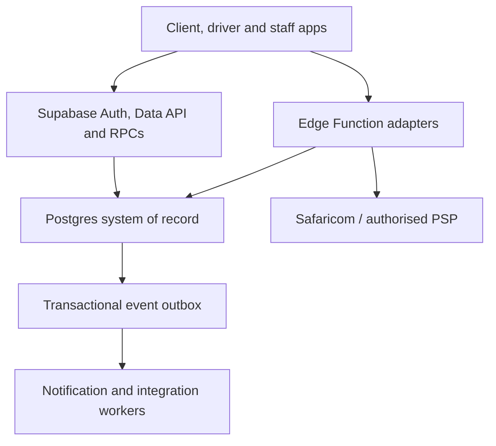
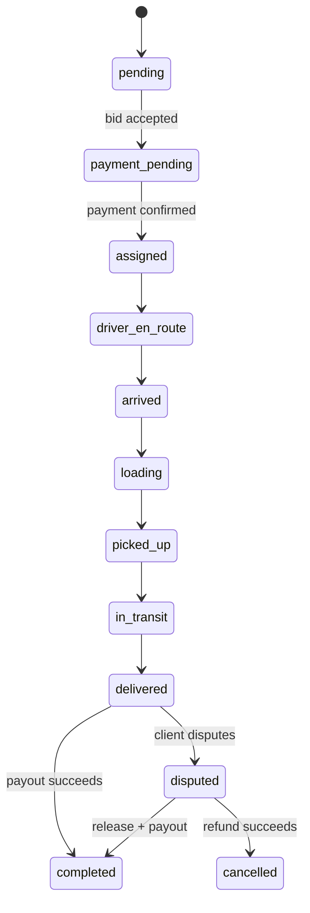
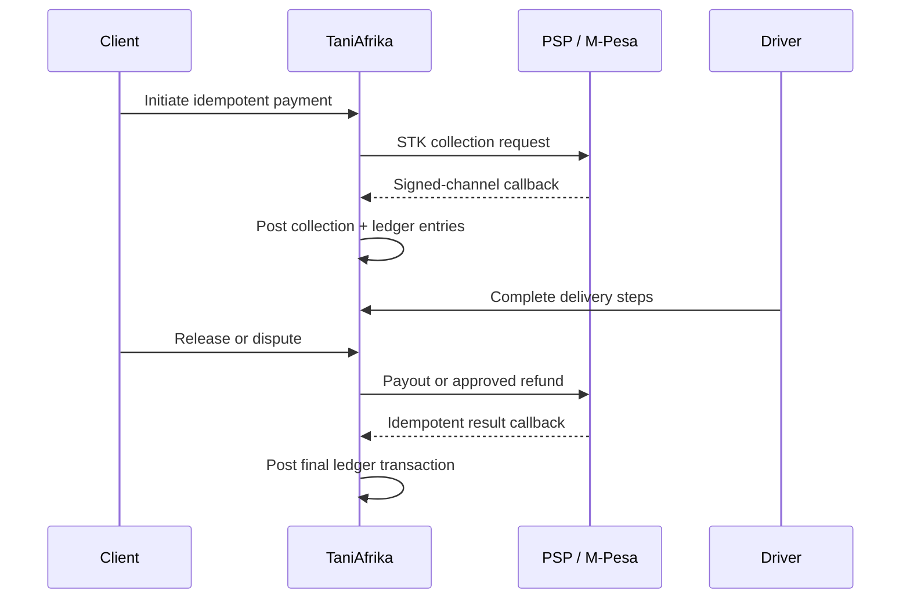

# Backend architecture

## Executive decision

TaniAfrika should launch on a modular monolith: one Supabase Postgres system of
record, explicit domain modules, transactional RPCs, Edge Function adapters and
a durable event outbox. This provides the most important qualities associated
with global mobility platforms—clear ownership, idempotency, auditability,
location-aware queries and financial correctness—without adopting their mature
microservice count before the organisation needs it.

Uber's published architecture work describes the operational complexity created
by very large microservice estates and the need to group them into domains.
Bolt's published finance engineering work emphasises a source-of-truth ledger
and payment reconciliation. Those lessons support strong domain boundaries and
an immutable ledger now, with service extraction later.

## Source review

The uploaded application already provided:

- client, driver and administrator surfaces;
- Supabase authentication and direct table access;
- orders, competitive bids and bid chat;
- driver location updates and an order status history;
- basic driver approval and vehicle management.

The uploaded brand/product document adds:

- two customer/driver progressive web app experiences;
- verified drivers and vehicles;
- competitive bidding;
- M-Pesa payment and a held/released payment experience;
- a “Reliable Neighbour” green and amber direction;
- English first, with Kiswahili expansion.

The original archive had no migrations, RLS policy source, Edge Functions,
payment ledger, tests, environment template, lockfile or deployment runbook.
Direct bid acceptance depended on an undocumented database trigger, and the
client and driver code assumed only a short three-step delivery lifecycle.

## Logical architecture

The browser uses a publishable key and user JWT. It never receives a secret or
service-role key. Any action that changes ownership, money or a state machine is
an RPC or Edge Function, not a sequence of unrelated client-side updates.

## Domain modules and tables

| Domain | Responsibility | Core tables |
|---|---|---|
| Identity | Users, roles, account state | `profiles`, `user_roles`, `driver_profiles` |
| Organisations | Business accounts and access | `organisations`, `organisation_members`, `saved_places` |
| Fleet/compliance | Vehicles, assignments, verification evidence | `vehicle_classes`, `vehicles`, `driver_vehicle_assignments`, `driver_documents`, `vehicle_documents` |
| Marketplace | Services, coverage, quotes, orders and bids | `service_types`, `service_areas`, `pricing_rules`, `orders`, `order_stops`, `order_items`, `order_attachments`, `bids`, `bid_messages` |
| Dispatch/location | Driver supply, offers and route events | `driver_availability_sessions`, `driver_locations`, `driver_location_events`, `dispatch_offers`, `order_status_history` |
| Money | Collection, held-funds state, payout, refund and disputes | `payment_intents`, `payment_provider_events`, `payment_transactions`, `escrow_holds`, `payout_accounts`, `payouts`, `refunds`, `financial_disputes` |
| Accounting | Immutable financial source of truth and reconciliation | `ledger_accounts`, `ledger_transactions`, `ledger_entries`, `reconciliation_runs`, `reconciliation_items` |
| Trust/operations | Safety, support, reviews, audit, privacy and messaging | `reviews`, `support_cases`, `support_case_messages`, `emergency_contacts`, `safety_incidents`, `safety_incident_evidence`, `notification_preferences`, `device_tokens`, `notifications`, `audit_events`, `consent_records`, `data_subject_requests`, `system_settings`, `feature_flags`, `event_outbox` |

PostGIS geography columns and GiST indexes support nearby-driver and service-area
queries. Routine route events have a configurable retention window; permanent
order/safety evidence is stored separately.

## Order lifecycle

`accept_bid` locks the order and selected bid, checks driver availability and a
verified vehicle, rejects competing bids, reserves the driver and calculates the
platform fee in one transaction. `update_order_status` enforces actor-specific
transitions and records each change. Completion is controlled by successful
payout posting, not by a browser update.

## Payment and held-funds model

The product may display “payment protected” or “held until delivery,” but the
database does not make TaniAfrika a licensed escrow provider. `escrow_holds` is
the platform's internal state for money actually safeguarded by the contracted
Safaricom/PSP/bank arrangement.

Controls implemented:

- money is stored as integer minor units and currency is explicit;
- provider references and client idempotency keys are unique;
- every callback payload is hashed and de-duplicated;
- amount/order/provider-reference mismatches move to manual review;
- posted ledger entries are immutable and every transaction must balance;
- payout/refund workers atomically claim rows and use bounded retries;
- dispute resolution requires finance/admin authority and notes;
- reconciliation structures exist for provider statement matching.

The included refund adapter uses an M-Pesa B2C-style return-to-customer flow as
a reference implementation. The contracted provider must confirm whether the
production rail is B2C, Reversal, or its managed refund API before activation.

## Security model

- All public tables have RLS enabled after default grants are revoked.
- Policies use user identity plus staff/finance/operations roles.
- `profiles_public` exposes only limited active marketplace identity data.
- Users receive column-level update grants only for editable profile fields;
  role, account and approval states are server managed.
- Driver and vehicle verification files are private Storage buckets.
- Order evidence is restricted to order participants and staff.
- Service-role access exists only in server/Edge contexts.
- CORS is an explicit allowlist; scheduler and provider callbacks use separate
  high-entropy secrets.
- Sensitive changes create audit records, while financial callback payloads are
  retained for traceability and reconciliation.

Before production, run automated cross-user RLS tests for every role and table,
rotate all secrets, enable provider IP/signature controls when supported, and
place security/operations alerts on callback failures, dead letters, unmatched
transactions and ledger imbalance attempts.

## Scalability path

Keep the transactional core together until measurements justify extraction.

1. Scale Postgres vertically, add read replicas for reporting, and tune PostGIS,
   partial and composite indexes from real query plans.
2. Move notification delivery and dispatch ranking behind outbox consumers.
3. Partition high-volume `driver_location_events`, provider events and audit
   events by time; archive according to approved retention schedules.
4. Extract payment orchestration only when a dedicated team, availability target
   or provider portfolio requires independent deployment. Preserve Postgres as
   the financial source of truth or introduce a carefully versioned ledger API.
5. Add regional boundaries only when real expansion requires data residency,
   latency or failure-domain isolation.

## Compliance boundary and launch review

The implementation is designed to support, not replace, professional review of:

- Kenya's National Payment System Act and Regulations, and the current Central
  Bank of Kenya payment service provider register;
- the Data Protection Act, regulations, registration/DPIA obligations,
  cross-border processing, data-subject requests and breach procedures;
- the NTSA Transport Network Companies, Owners, Drivers and Passengers
  Regulations and any classification that applies to the exact service model;
- tax, insurance, employment/contractor, consumer protection and marketplace
  terms.

## Primary references

- [Uber: Domain-Oriented Microservice Architecture](https://www.uber.com/us/en/blog/microservice-architecture/)
- [Bolt: Finance Ledger as a Service](https://bolt.eu/en/blog/finance-ledger-as-a-service/)
- [Bolt: Tracking Payments at Scale](https://bolt.eu/en/blog/tracking-payments-at-scale/)
- [Supabase Row Level Security](https://supabase.com/docs/guides/database/postgres/row-level-security)
- [Supabase Database Webhooks](https://supabase.com/docs/guides/database/webhooks)
- [Supabase Edge Function secrets](https://supabase.com/docs/guides/functions/secrets)
- [Safaricom Daraja APIs](https://developer.safaricom.co.ke/apis)
- [Central Bank of Kenya: National Payment System](https://www.centralbank.go.ke/national-payments-system/)
- [Kenya National Payment System Act](https://new.kenyalaw.org/akn/ke/act/2011/39/eng%402023-09-15)
- [Kenya Data Protection Act](https://new.kenyalaw.org/akn/ke/act/2019/24/eng%402022-12-31)
- [Kenya Transport Network Companies Regulations](https://new.kenyalaw.org/akn/ke/act/ln/2022/120/eng%402022-12-31)
