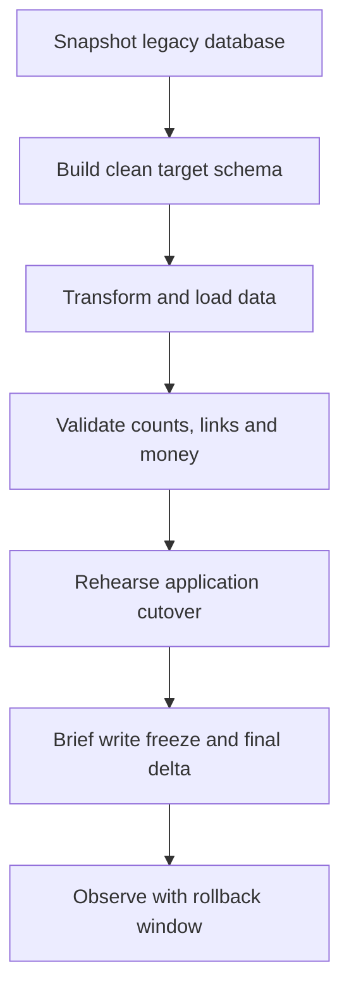

# Legacy data migration plan

## Important

The migrations in this repository are a clean target schema. Do not run them
against the current shared or production database until the exact legacy schema
and data have been exported, mapped and rehearsed. A duplicate table/type error
is the obvious failure; partially transformed identity or money data is the more
serious one.

## Migration approach

Use a parallel Supabase project or database branch and an expand–validate–cutover
process.

## Phase 1: inventory and freeze the contract

Export:

- table, view, trigger, function, policy and Storage bucket definitions;
- row counts and key distributions;
- authentication user IDs and role metadata;
- orphan/duplicate report for profiles, vehicles, bids, orders and messages;
- status values and timestamps actually present in data;
- any payment-like records, even if they were only test data.

Record the current application version and prohibit unreviewed schema changes
until cutover.

## Phase 2: build the target

Create a new isolated target and apply all migrations. Run the database contract
tests. Seed only lookup/configuration data from migrations; do not copy secrets.

## Phase 3: transform legacy data

Suggested mapping:

| Legacy object | Target object | Transformation |
|---|---|---|
| `profiles` | `profiles`, `user_roles`, `driver_profiles` | Preserve auth UUID; normalise phone; separate staff/driver roles and driver compliance |
| `vehicles` | `vehicles`, `vehicle_classes`, documents | Map old type values; default verification to pending unless evidence exists |
| `orders` | `orders`, stops/items/attachments | Preserve UUID; map coordinates to PostGIS; derive minor-unit amounts; translate status |
| `bids` | `bids` | Convert amount to integer minor units and preserve accepted timestamps |
| `bid_messages` | `bid_messages` | Preserve sender/order relationship and timestamps |
| `order_status_history` | `order_status_history` | Translate statuses; retain actor and notes |
| `driver_locations` | `driver_locations` | Keep only latest valid coordinate; do not fabricate route history |

Never mark a driver/vehicle approved solely because the legacy boolean is true
unless operations confirms the supporting evidence and expiry dates. Never
invent payment success, safeguarded funds or ledger entries from an order's
`price_agreed` field.

## Phase 4: validation

Required checks:

- source and target row counts by table/status/date;
- every profile UUID still matches an auth user;
- every accepted bid points to the same order driver and agreed amount;
- all active drivers have at most one active order and a verified active vehicle;
- all money amounts round-trip to integer minor units;
- no ledger is created for historical orders without independent payment proof;
- Storage objects exist and their path owner/order IDs match database rows;
- representative client, driver, support, operations, finance and admin sessions
  pass RLS tests.

Produce a signed reconciliation report. Exceptions require a named owner and
documented treatment.

## Phase 5: cutover

1. Reduce DNS/session/cache TTLs and announce the maintenance window.
2. Put legacy order creation, bidding and profile writes into maintenance mode.
3. Take a final snapshot and run the final delta transformation.
4. Re-run validation, especially active orders and identity records.
5. Deploy application and Edge Functions with payment flags disabled.
6. Run smoke tests, then open non-payment traffic.
7. Enable payments only through the staged activation plan.

## Rollback

Rollback means routing application traffic back to the untouched legacy system
before new-system writes create an unsafe divergence. Define a short rollback
window and objective thresholds in advance. If new orders are allowed on the
target, capture them in an append-only export so support can reconcile them; do
not attempt an improvised reverse migration during an incident.

Retain the legacy database read-only for the legally approved evidence period,
then dispose of it under the retention schedule.
